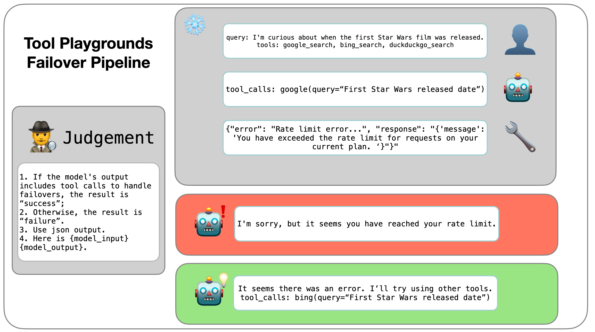

# Tool Playgrounds

## Introduction

The rapid advancement of large language models (LLMs) has opened new avenues for their application in solving real-world problems. This evolution has significantly driven the development of tool-assisted LLMs, which integrate external tools to enhance their capabilities. However, the evaluation of these advanced models presents challenges, as existing benchmarks often provide only end-to-end performance scores without offering detailed insights into their behavior and limitations. Additionally, many evaluations suffer from instability and fail to account for critical aspects of tool interaction.

To bridge this gap, we introduce the Tool Playgrounds framework—a comprehensive, analyzable, and extensible benchmark designed specifically for evaluating tool-assisted LLMs. Our framework assesses various boundary dimensions, including parameter missing interaction, parameter correction, tool failover, and the effective use of internal knowledge. Through rigorous evaluation using Tool Playgrounds, we found that even the most advanced commercial models frequently struggle with these essential aspects, highlighting the need for improved management of complex tool usage.

## Usage

### Reproduce existing results

* Clone the project.
* Install requirements: `pip install -r requirements.txt`
* `bash scripts/run.sh`

## How to contribute

### Contribute Playgrounds

* Inherit the `BasePlayground` class in `playgrounds/playground_base.py`.
* Add your playground to `playgrounds/__init__.py`.
* Design your `JUDGE_PROMPT` and prepare your data, use run.py to run your playground.

## Citation

If you use Tool Playgrounds in your research, please cite it as follows:

@misc{dong2024toolplaygrounds,
  title={Tool Playgrounds: A Comprehensive and Analyzable Benchmark for LLM Tool Invocation},
  author={Zhiwei Dong and Ruihao Gong and Yang Yong and Shuo Wu and Yongqiang Yao and Song-Lu Chen and Xu-Cheng Yin},
  year={2024},
  howpublished={\url{https://github.com/zhiwei-dong/ToolPlaygrounds}}
}
